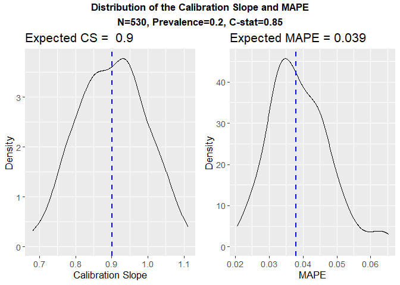

<!-- README.md is generated from README.Rmd. Please edit that file -->

# samplesizedev

<!-- badges: start -->
<!-- badges: end -->


This package relates to the article

#### "An evaluation of sample size requirements for developing risk prediction models with binary outcomes"
published in BMC Medical Research Methodology https://doi.org/10.1186/s12874-024-02268-5


The package samplesizedev performs unbiased sample size calculations
(using simulation) for the development of risk models for binary
outcomes. It requires information on the anticipated values of the:

- outcome prevalence

- c-statistic (AUC)

- number of predictor variables

to calculate the sample size required to achieve a target expected calibration slope
(S) or Mean Absolute Prediction Error (MAPE), on average. 

Functionality for **time to event outcomes** will be made available in due course. 

## Installation

The development version of samplesizedev can be installed from
[GitHub](https://github.com/) with:

``` r
# If package 'devtools is not installed, first install it'
 install.packages("devtools")
 require("devtools")

devtools::install_github("mpavlou/samplesizedev")
require(samplesizedev)
```

Please get in touch (m.pavlou@ucl.ac.uk) for any bugs you spot and or any suggestions for improvement you may have. 

## Example

This is a basic example which shows how to calculate:

1)  the **sample size** to achieve a target expected
    calibration slope (e.g. S=0.9)

2)  the **expected calibration slope and MAPE** for a given
    sample size, and

``` r
library(samplesizedev)

# Explore the two main commands:
# ?samplesizedev
# ?expected_cs
```

### Calculation of sample size for given model characteristics, aiming for expected calibration slope S=0.9 

``` r
# Calculate sample size for target calibration slope
# Target Calibration slope S=0.9; Prevalence=0.2; c-statistic=0.85; Number of predictors=10;
# Calcualtion takes about a minute 

samplesizedev(outcome="Binary", S = 0.9, phi = 0.2, c = 0.85, p= 10)
#> [1] "Optimisation Starting, ~ 1 min left..."
#> $rvs
#> [1] 308
#> 
#> $sim
#> [1] 500

# $sim is the sample size calculated by simulation
# $rvs is the sample size calculated using the approach of Riley et al. (2019) (RvS formula Criterion 1 - overfitting)
```

The sample size calculated using simulation is n$sim=500 which corresponds to CS=0.9. In comparison, 
the sample size using previously proposed formulae is n$rvs=308. According to the findings in our paper
the RvS overfitting  ##underestimates## the sample size for high C-statistic. Thus, the expected calibration slope will
be in fact lower than we had aim for. We can check that using the second command of our package 'expected_cs'.


### Calculation of expected model performance (CS, MAPE etc) for a given sample size and model characteristics

``` r
# Calculate the expected calibration slope and MAPE
# Sample size=308; Prevalence=0.2; C-statistic=0.85; Number of predictors=10
# Calculation takes a few seconds

expected_cs(outcome="Binary", n = 308, phi = 0.2, c = 0.85, p = 10)
```


#>    N Mean_CS SD_CS Pr(CS<0.8) Mean_MAPE SD_MAPE Prev. C-Stat.  # Predictors
#>1 308   0.844 0.127       0.38    0.0509  0.0118   0.2    0.85            10

As expected, the expected calibration slope for n$rvs=308 is 0.844, smaller than 0.9. The variability is high which translates to 
38% chance of actually getting a model with CS<0.8 when we develop a model with data of that size. To get an expected calibration 
slope of 0.9 we need to inflate n$rvs by 60% to reach!! We confirm this:  



#>     N Mean_CS  SD_CS Pr(CS<0.8) Mean_MAPE SD_MAPE Prev. C-Stat.  # Predictors
#> 1 500   0.902 0.1002       0.16    0.0393  0.0087   0.2    0.85            10

Note that although the calibration slope is on average 0.9 (and Probability of CS<0.8 has reduced to 16%) still  *we are not guaranteed* 
to achieve that performance for every development sample of size 500 in this case...


