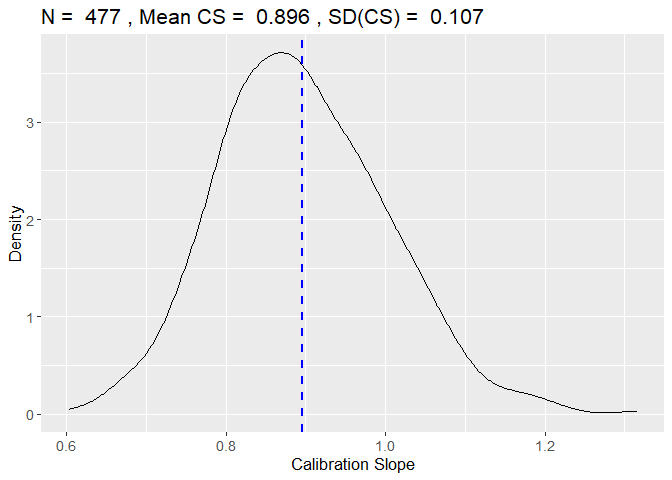
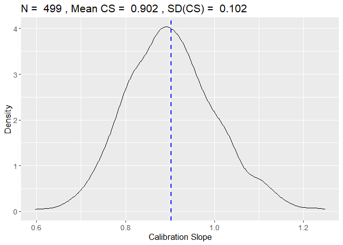

<!-- README.md is generated from README.Rmd. Please edit that file -->

# samplesizedev

<!-- badges: start -->
<!-- badges: end -->

The package samplesizedev performs unbiased sample size calculations for
the development of risk models.

## Installation

You can install the development version of samplesizedev from
[GitHub](https://github.com/) with:

``` r
# If package 'devtools is not installed, first install it'
# install.packages("devtools")
# require("devtools")
devtools::install_github("mpavlou/samplesizedev")
require(samplesizedev)
```

## Example

This is a basic example which shows how to a) to calculate the expected
shrinkage and MAPE for a given sample size, and b) To calculate the
sample size to achieve a target expected shrinkage of S=0.9 for a binary
outcome

``` r
library(samplesizedev)

expected_cs(n = 530, phi = 0.2, c = 0.85, p = 10, nsim = 1000)
```


    #>     N Mean_CS  SD_CS RMSD_CS Pr(CS<0.8) Mean_MAPE SD_MAPE Prev. C-Stat.
    #> 1 530   0.902 0.0977  0.1383       0.14    0.0379  0.0085   0.2    0.85
    #>    # Predictors
    #> 1            10

    samplesizedev(outcome="Binary", S = 0.9, phi = 0.2, c = 0.85, p= 10,  nsim = 1000)
    #> [1] "Optimisation Starting, ~ 1-2 min left..."



    #> $rvs
    #> [1] 308
    #> 
    #> $sim
    #> [1] 500
