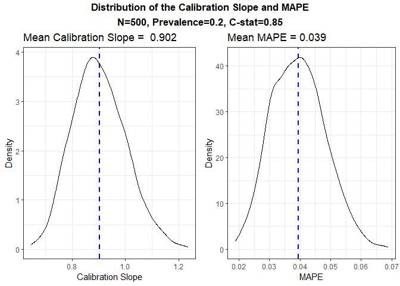
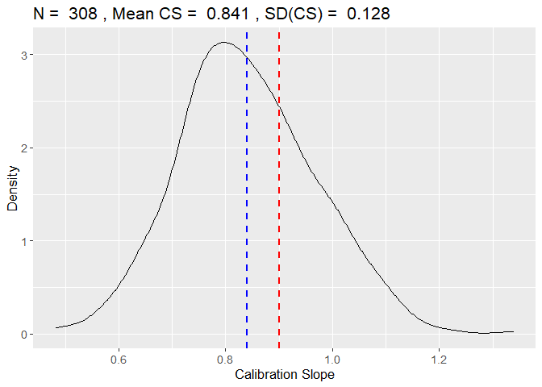
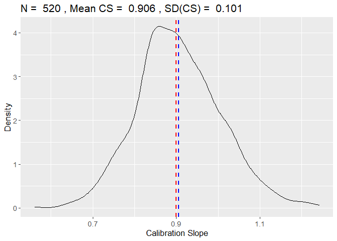

<!-- README.md is generated from README.Rmd. Please edit that file -->

# samplesizedev

<!-- badges: start -->
<!-- badges: end -->

The package samplesizedev performs unbiased sample size calculations for
the development of risk models.

## Installation

You can install the development version of samplesizedev from
[GitHub](https://github.com/) with:

``` r
# install.packages("devtools")
devtools::install_github("mpavlou/samplesizedev")
```

## Example

This is a basic example which shows how to calculate the sample size for
a binary outcome

``` r
library(samplesizedev)

samplesizedev(outcome="Binary", S = 0.9, p = 0.2, c = 0.85, n.predictors = 10,  nsim = 500, parallel = TRUE)
#> [1] "Optimisation Starting ~ 1 min left..."
```



    #> [1] 1


    #> [1] 2


    #> [1] 3



    #> [1] 4
    #> $riley
    #> [1] 305
    #> 
    #> $actual
    #> [1] 530

You’ll still need to render `README.Rmd` regularly, to keep `README.md`
up-to-date. `devtools::build_readme()` is handy for this. You could also
use GitHub Actions to re-render `README.Rmd` every time you push. An
example workflow can be found here:
<https://github.com/r-lib/actions/tree/v1/examples>.

In that case, don’t forget to commit and push the resulting figure
files, so they display on GitHub and CRAN.
